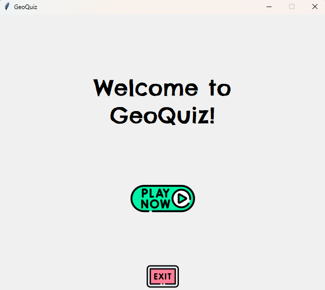
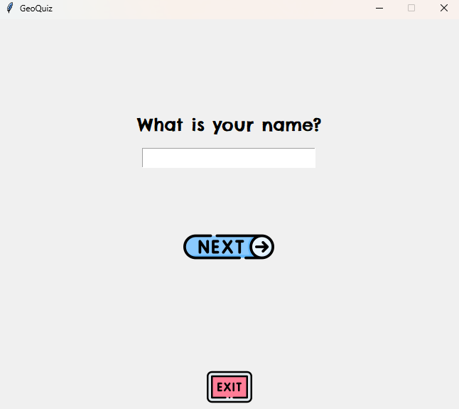
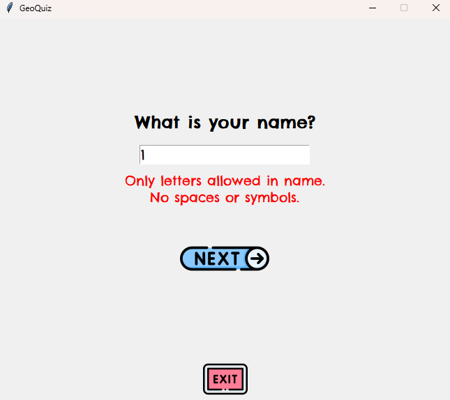
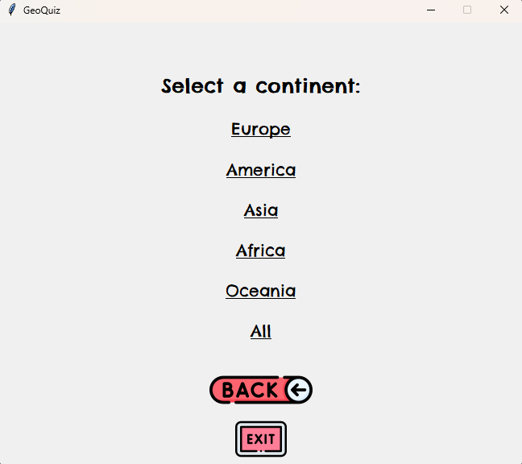
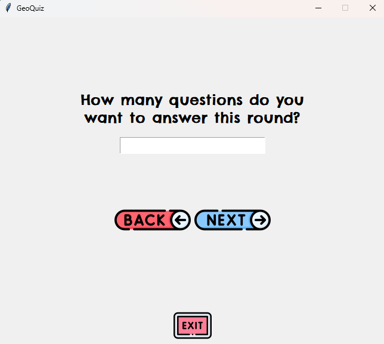
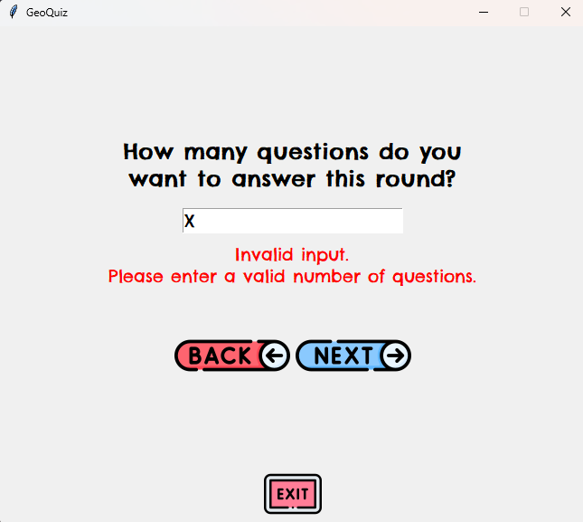
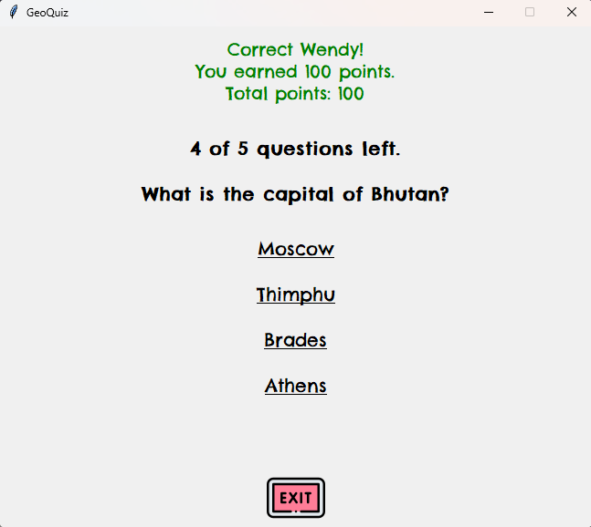
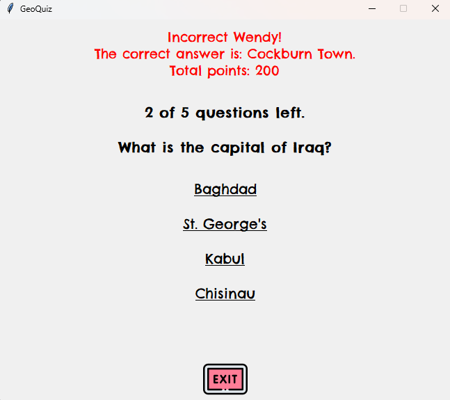

# Geo Quiz Game 

GeoQuiz is a geography quiz game developed in Python using the Tkinter library. It was created as my first programming project during my first Python course in 2024.
The main goal of the game is to help users learn world capitals in a fun and interactive way. The program displays a random country and asks the user to choose its correct capital from multiple options. All data is stored in a SQLite database, which allows for dynamic and varied questions every time the game is played.

## 🚀 Getting Started

1. Clone the repository or download the files
2. Make sure your images and capital.db are in the correct place.
3. Run the game:

```bash
python geoQuiz.py
```

## 🛠️ Requirements

- Python 3.x
- Tkinter (usually included with Python)
- SQLite3 (included with Python)
- The following image files in a src/ directory:
    - btn_start.png
    - btn_exit.png
    - btn_next.png
    - btn_back.png
    - btn_restart.png
    - btn_home.png
- A valid database file: capital.db, with tables for each continent (europe, america, asia, africa, oceania), each with at least columns country and capital.

## 💡 How It Works

1. The player starts the game and enters their name.
2. They choose a continent or all continents combined.
3. The player selects how many questions they want to answer.
4. For each question:
   - A country is randomly selected.
   - 4 capitals are shown, 1 of which is correct.
   - Points are awarded for correct answers.
5. Final score is shown, and the user can restart or exit.

---

### 🧱 Project Structure
```
GeoQuiz/
├── src/
│   ├── btn_start.png
│   ├── btn_exit.png
│   ├── btn_next.png
│   ├── ...
├── capital.db
├── geoQuiz.py
└── README.md
```

### 🧪 Features

- 🌐 Choose from specific continents or all countries
- 🎮 Set how many questions you want to answer per round
- 💯 Earn 100 points per correct answer
- ✍️ Name entry with input validation
- 🔄 Option to restart or go back to home screen
- 🗃️ Capital cities stored in a SQLite database
- 🎨 GUI designed with Tkinter and custom button images

## 📸 Screenshots











## 📚 🔧 Dependencies

- 🐍 Python 3
- 🗃 SQLite3 for database
- 🎨 PhotoImage for custom buttons
- 🖼️ Tkinter for GUI (usually pre-installed with Python)
If not installed, you can run:

```bash
pip install tk
```

## 👩‍💻 Author
**Wendy Cuellar**  
[LinkedIn](https://www.linkedin.com/in/wendyvelasquez20/) | [GitHub](https://github.com/WendyVelasquez)

## 📃 License
This project is licensed under the MIT License.

---